# ProjectOne_Team2
House Price Predictor 

A home is essential to modern day living and with rising costs and a struggling economy it has become even harder to find a good place to live. If only there was a tool that could make buying a new home a piece of cake instead of a generational gamble. In this project we will investigatve affordability of housing in the dallas metro area. 
The major factors we will use are population, household income, and the housing price index.
By using all of these factors We will look at the past data from 1997 to present day and document the growth and trends in the housing market. We will also visualize the corrilation of population, income and housing costs.
Lastly, we will look to project where the housing cost will be over the next 2 years.

 We started with three of the biggest counties in North Texas.For each county we collected a data series which included: housing price index(HPI), population(POP), and houshold income(HI). 

 
 The three counties being Collin, Dallas, and Denton. We structured our model to be able to then use the model to look at other counties in the Dallas Ft Worth Metropolitan area.

 

 # Table of Contents
 - [Overview](#Overview)
 - [Housing trends in DFW](#housing-trends-in-dfw)
 - [Population trends in DFW](#population-trends-in-dfw)
 - [Household Income trends in DFW](#household-income-trends-in-dfw)
 - [Correlations](#correlations)
  - [HPI & POP](#hpi--pop-correlation-graph)
  - [HPI & HI](#hpi--hi-correlation-graph)
 - [Recommended Next Steps](#recommended-next-steps)
 - [References](#references)

# Overview

Going into this project we predicted that there would be a stronger correlation between household income and the housing price index than the population and the housing price index.
 
With the data we collected we were able to graph out and analyze the trends in the data to show the correlation between HPI, POP, and HI. 

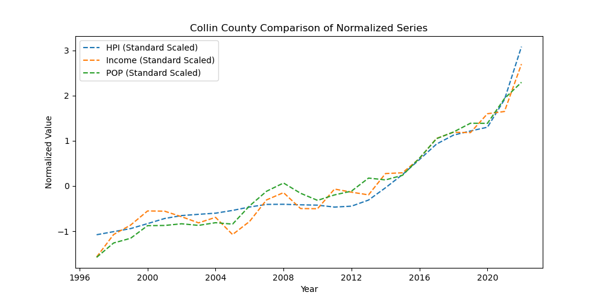

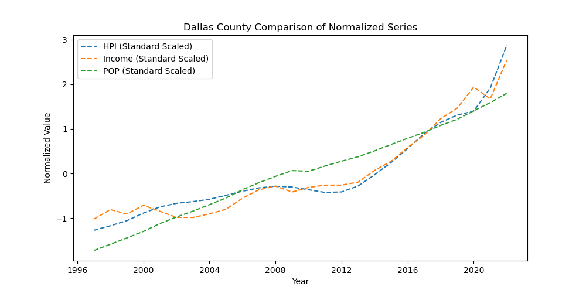

# Housing Trends in DFW 

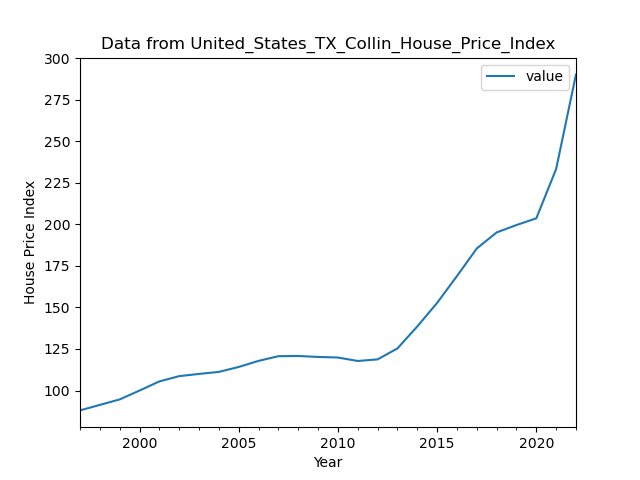

Collin Housing Trends 

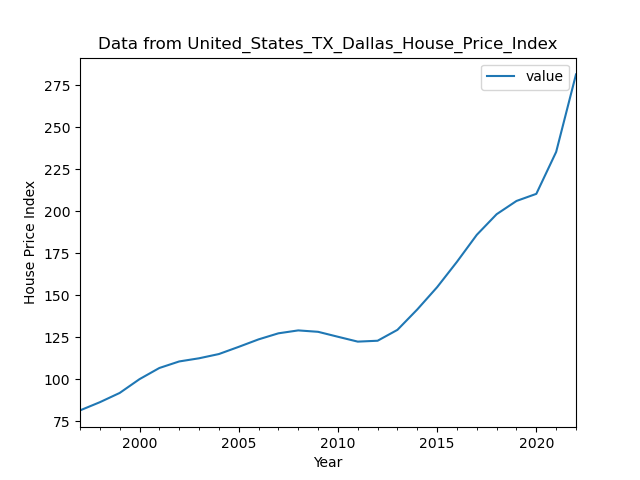

Dallas Housing Trends  

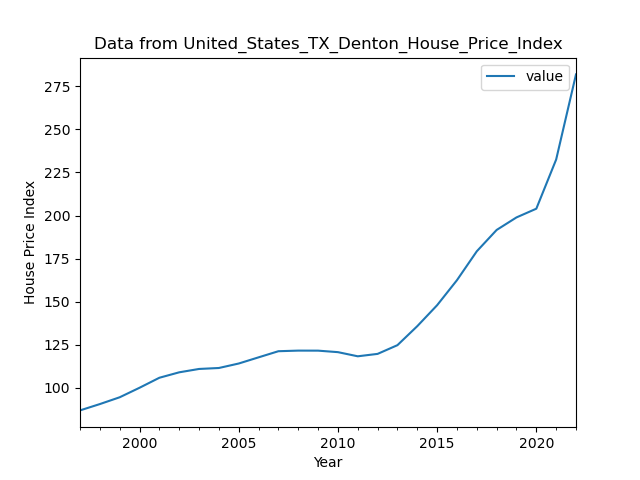

Denton Housing Trends  

# Population trends in DFW

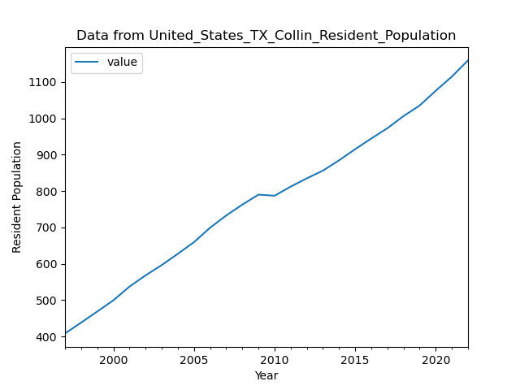

Collin Population 

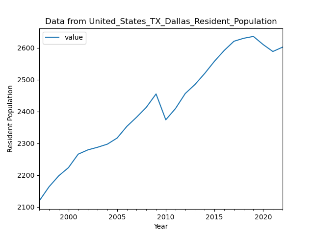

Dallas Population 

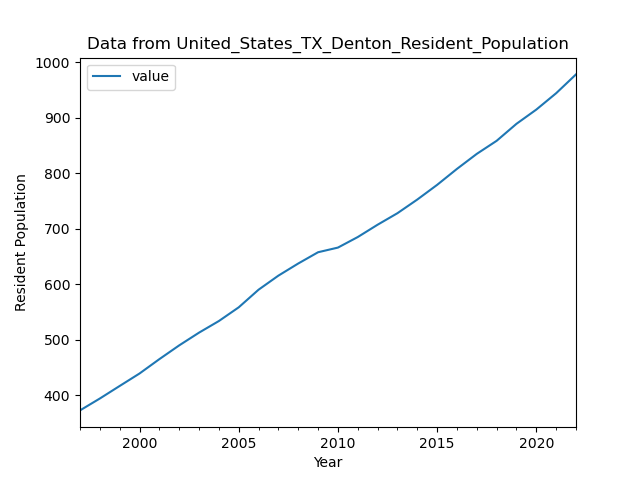

Denton Population 

# Household Income trends in DFW

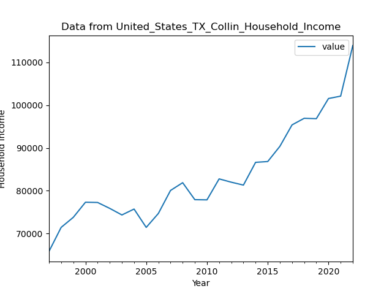

Collin Housing Income

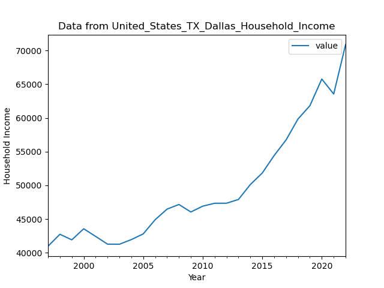

Dallas Housing Income 

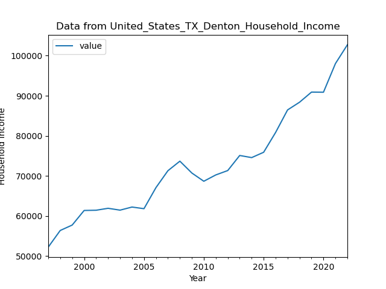

Denton Housing Income 

# Correlations

# HPI & HI correlation graph

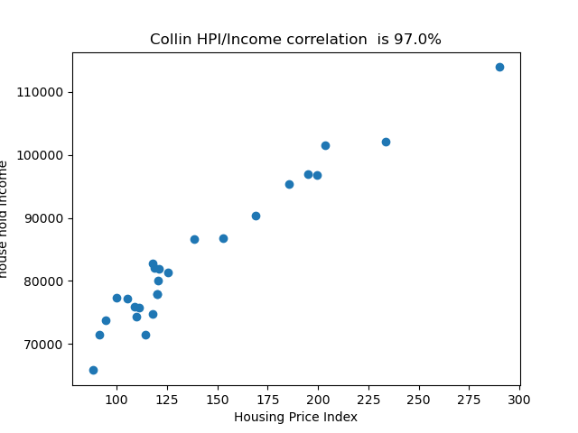

97 Correlation

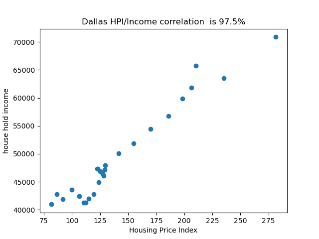

97.5 Correlation

96.2 Correlation

# HPI & POP correlation graph

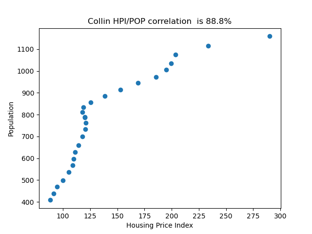

88.8 Correlation

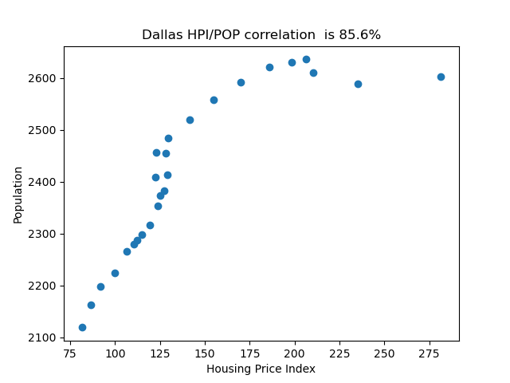

85.6 Correlation

89.9 Correlation

We were able to conclude that there is a strong correlation between all three  of the variables, Housing Price Index (HPI), Population (POP) and Household  Income (HI). Our model found and showed us that the correlation between the  amount of people moving to a location can affect how much a house cost. 
  
# Recommended Next Steps
We have it to where our model can predict the future of the housing market based  on past data. We can run our model to reflect however many years in the future  we would like to see. We are also able to have our model provide correlations and  predictions with any county in the whole United States, but it doesn’t end there.  We can predict the housing market in any country around the world as well as  long as the data is accurate and available for us to feed into the model.  

# References

U.S. Census Bureau, Resident Population in Anderson County, TX [TXANDE1POP], retrieved from FRED, Federal Reserve Bank of St. Louis; https://fred.stlouisfed.org/series/TXANDE1POP, April 21, 2024.

U.S. Census Bureau, Estimate of Median Household Income

U.S. Federal Housing Finance Agency, All-Transactions House Price Index for Anderson County, TX [ATNHPIUS48001A], retrieved from FRED, Federal Reserve Bank of St. Louis; https://fred.stlouisfed.org/series/ATNHPIUS48001A, April 19, 2024.